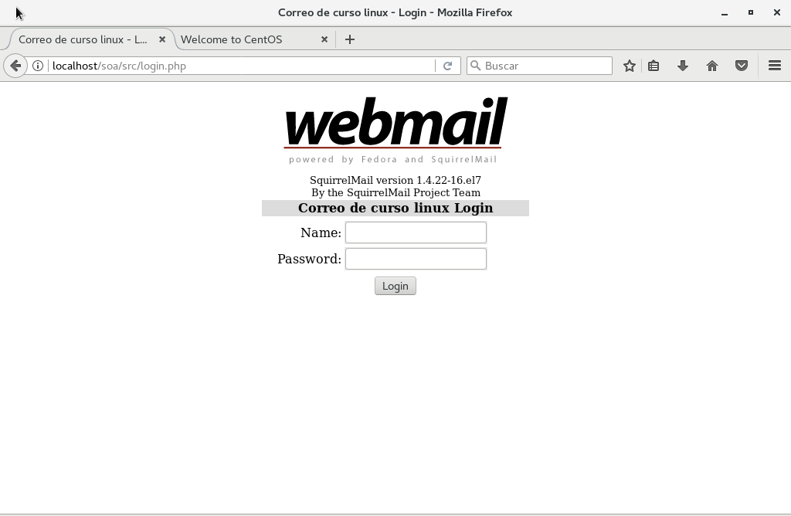
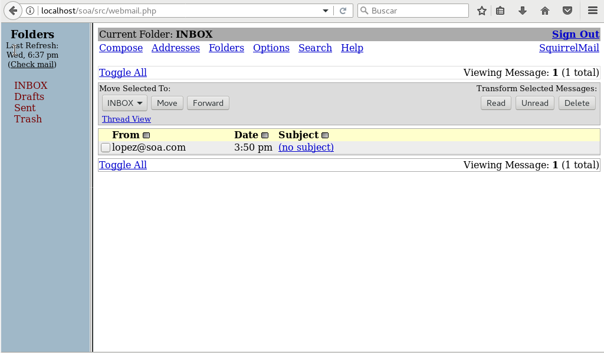

# Paso a paso: Instalación de servidor de correos 

Instalación paso a paso de Postfix, Dovecot y Squirrelmail.

## Preparación de entorno
### Eliminar servidor de correos existente.
```
yum remove sendmail
```

### Agregar dominio a host
Esto es temporal.
```
nano /etc/hosts
```
Donde debes agregar las lineas (la IP debe ser la misma de la máquina `ifconfig`):
```
192.168.122.1	mail.soa.com
```

### Deshabilitar control obligatorio de acceso SELINUX
CentOS por defecto incluye politicas 

Permite actualizar los paquetes.
Editar archivo `/etc/sysconfig/selinux`, para cambiar línea `SELINUX=enforcing` a `SELINUX=disabled`

## Instalar epel-release
```
yum install epel-release
```

## Configuración de firewall
Abre puerto en firewall.
```
firewall-cmd --permanent --add-port=80/tcp
```
Reiniciar firewall
```
firewall-cmd --reload
```

# Instalación de POSTFIX
```
yum install postfix
```

# Configurando POSTFIX

Editar archivo de configuración `/etc/postfix/main.cf`.
Descomentar las lineas necesarias, para establecer las siguientes variables.
```
myhostname = mail.soa.com
mydomain = soa.com
myorigin = $mydomain
inet_interfaces = all
inet_protocols = all
mydestination = $myhostname, localhost.$mydomain, localhost, $mydomain
mynetworks=192.168.122.1 (?)
home_mailbox = Maildir/
```

Reiniciamos postfix
```
systemctl enable postfix
systemctl restart postfix
```

### Agregar usuario de prueba
useradd lopez
passwd lopez (ingresar password)


### Redactando un correo por Telnet
Instalar telnet
```
yum install telnet
```

```
telnet localhost smtp 
>
> ehlo localhost
> mail from:<lopez>
rcpt to:<lopez>
> data
> MENSAJE DE PRUEBA
> [Terminar mensaje con .]
> Ctrl+D
```

Revisar correo enviado
```
cd /home
ls (se ven los usuarios)
cd lopez/Maildir
cd new
cat 14....
```


> [root@localhost new]# cat 1529509837.Vfd00110594dM217538.1ocalhost.localdomain 
Return-Path: <lopez@soa.com> 
X-Original-To: Lopez 
Delivered-To: lopez@soa.com 
Received: from localhost (localhost [IPv6:::1]) 
by mail.soa.com (Postfix) with E5MTP id C568F918F4F 
for clopez>; Wed, 28 Jun 2818 11:49:58 -8488 (-84) 
Message-Id: <20180620155010.C568F910F4F@mail.soa.com> 
Date: Wed, 28 Jun 2818 11:49:58 -8488 (-84) 
From: lopez@soa.com 
MENSAJE DE PRUEBA 
quit 
[root@localhost new]# 


¡Ahí comprobamos que el correo se envió exitosamente!

## Instalación de dovecot
```
yum install dovecot
```
Editar  /etc/dovecot/dovecot.conf

Descomentar
```
protocols = imap pop3 lmtp
```

Editar `/etc/dovecot/conf.d/10-mail.conf`, y descomentar
```
mail_location = maildir:~/Maildir
```


Editar `/etc/dovecot/conf.d/10-auth.conf`, y descomentar.
```
disable_plaintext_auth = yes
auth_mechanisms = plain login
```

Editar `/etc/dovecot/conf.d/10-master.conf`, y descomentar.
```
service dict {
	unix_listener dict {
    	#mode = 0600
        user = postfix
        group = postfix
    }
}
```

Reiniciar dovecot
```
systemctl enable dovecot
systemctl start dovecot
```

```
telnet localhost pop3
user lopez
pass 123456
retr 1
.
quit
```

## Instalar squirrelmail


### Instalación
```
yum install squirrelmail
```

### Configurar squirrelmail
```
cd /usr/share/squirrelmail/config
./conf.pl
```
Aparece un menú. Debes acceder a:

> **1. Organization preferences**
> 1. Organization name : Sistema de correo de prueba

> **3. Server settings:**
> 1. Domain: soa.com
> 2. Sendmail or SMTP: SMTP

### Agregar alias en Apache
Editamos el archivo `nano /etc/httpd/conf/httpd.conf`

Agregamos ALIAS al final del archivo.
```
Alias /soa /usr/share/squirrelmail
<Directory /usr/share/squirrelmail>
 Options Indexes FollowSymLinks
 RewriteEngine On
 AllowOverride All
 Directorylndex index.php
 Order allow,deny
 Allow from all
</Directory>
```

Reiniciamos Apache.
```
systemctl restart httpd
```

Acceder via navegador: `192.168.1.9/soa`

Si intentamos iniciar sesión en la plataforma, aparacerá un error
> Error connecting to IMAP server: localhost.
> 13: Permission denied

Para esto, debemos ejecutar el siguiente comando:
```
setsebool httpd_can_network_connect=1
```

¡Ahora podrás iniciar sesión con la cuenta previamente creada!



Podemos revisar el último correo enviado.


